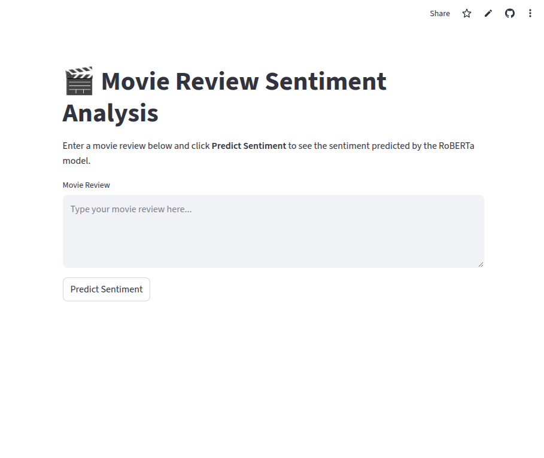
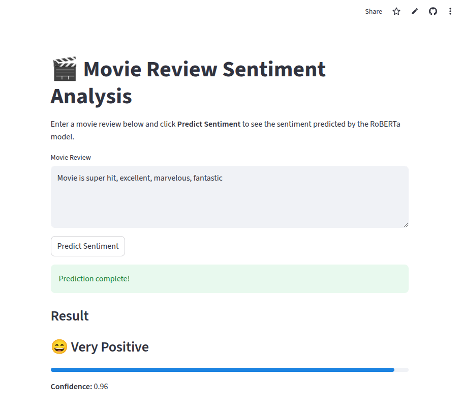
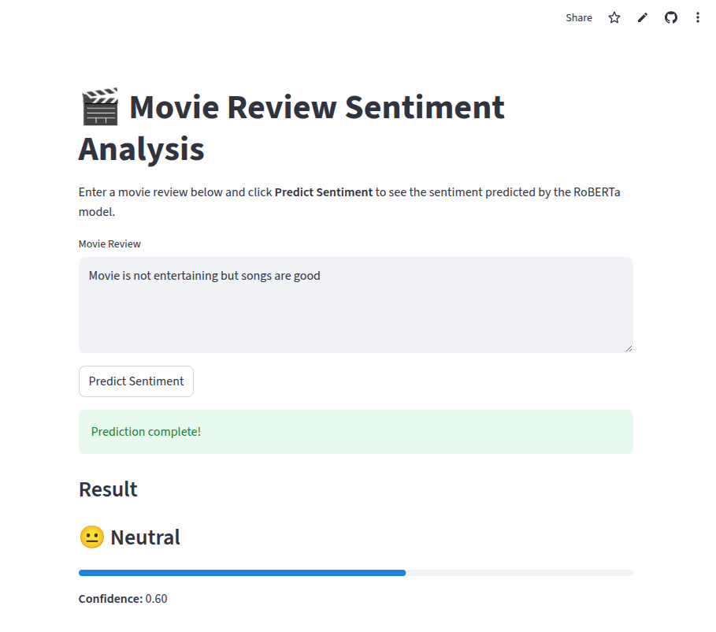
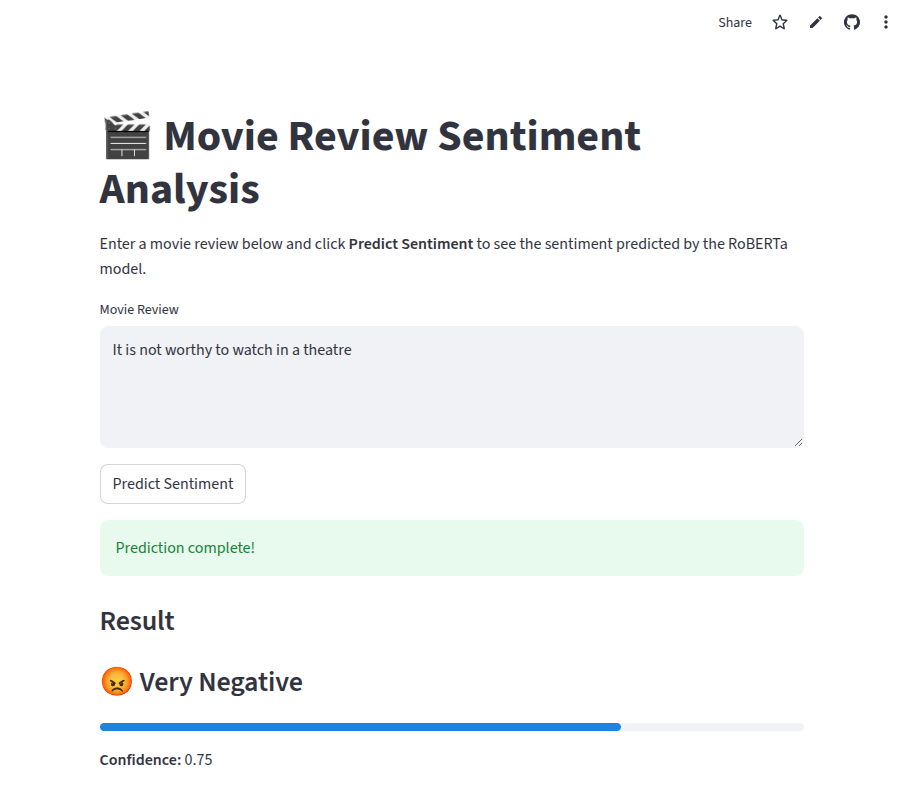

# 🎬 Movie Review Sentiment Analysis using RoBERTa

This project presents an **end-to-end sentiment analysis system** for movie reviews using a **fine-tuned RoBERTa model**, deployed as an **interactive web application** with **Streamlit**.

The system classifies a given movie review into **five sentiment categories** and displays both the **predicted sentiment** and the **model’s confidence score**.

---

## 🚀 Live Demo

🔗 **Deployed Application (Streamlit Cloud)**
👉 [https://sentiment-analysis-roberta-streamlit.streamlit.app](https://sentiment-analysis-roberta-streamlit.streamlit.app)
<p align="center">
  
</p>

---

## 📌 Sentiment Classes

| Label ID | Sentiment     |
| -------: | ------------- |
|        0 | Very Negative |
|        1 | Negative      |
|        2 | Neutral       |
|        3 | Positive      |
|        4 | Very Positive |

---

## 🧠 Model Overview

* **Base Model**: `roberta-base`
* **Architecture**:
  RoBERTa encoder + custom classification head (Linear + Dropout)
* **Frameworks**:

  * PyTorch
  * Hugging Face Transformers
* **Task**: 5-class sentiment classification
* **Input**: Raw movie review text
* **Output**: Sentiment label + confidence score

---

## 📊 Dataset

* **Dataset**: Movie review sentiment dataset (TSV format, SST-style)
* **Key Columns**:

  * `Phrase`: Movie review text
  * `Sentiment`: Ground truth label (0–4)
* **Total Samples**: ~156,000
* **Train / Validation Split**: 80% / 20%

---

## 📈 Evaluation Metrics

The model is evaluated using **Accuracy** and **Macro F1 Score**, which are suitable for multi-class sentiment classification.

### 🔹 Accuracy

* Measures the overall percentage of correct predictions.
* Validation Accuracy achieved: **~69.5%**

### 🔹 Macro F1 Score

* Computes F1 score **independently for each class** and then averages them.
* Treats all sentiment classes equally (important for class imbalance).
* Validation Macro F1 Score: **~0.62**

📌 **Why Macro F1?**
In sentiment analysis, some classes (e.g., Neutral) may dominate the dataset.
Macro F1 ensures that minority sentiment classes (Very Negative / Very Positive) are evaluated fairly.

---
## 🖥️ Web Application (UI)

The Streamlit-based web application allows users to input movie reviews
and instantly view sentiment predictions along with confidence scores.

<table align="center">
  <tr>
    <td align="center">
      <b>Home</b><br>
      
    </td>
    <td align="center">
      <b>Positive</b><br>
      
    </td>
  </tr>
  <tr>
    <td align="center">
      <b>Neutral</b><br>
      
    </td>
    <td align="center">
      <b>Negative</b><br>
      
    </td>
  </tr>
</table>


---

## 📂 Project Structure

```
Sentiment_Analysis_Using_RoBERTa/
│
├── app.py                  # Streamlit UI
├── inference.py            # Model loading & prediction logic
├── requirements.txt        # Python dependencies
├── README.md               # Project documentation
│
├── model/                  # Trained model & tokenizer (Git LFS)
│   ├── roberta_sentiment.pt
│   ├── vocab.json
│   ├── merges.txt
│   ├── tokenizer_config.json
│   └── special_tokens_map.json
│
└── Train_and_Test/         # Dataset files (ignored in GitHub)
```

---

## ⚙️ Local Setup (Optional)

```bash
git clone https://github.com/KondetiAravind/sentiment-analysis-roberta-streamlit.git
cd sentiment-analysis-roberta-streamlit

python3 -m venv venv
source venv/bin/activate

pip install -r requirements.txt
```

---

## ▶️ Run Locally

```bash
streamlit run app.py
```

Open in browser:

```
http://localhost:8501
```

---

## 🌐 Deployment Details

* **Platform**: Streamlit Cloud
* **Source Control**: GitHub
* **Large Model Handling**: Git Large File Storage (Git LFS)
* **Deployment Mode**:

  * Automatic redeployment on every push to `main`
  * CPU-based inference (GPU not required)

The deployed app is **publicly accessible**, **persistent**, and **shareable**.

---

## 🎯 Key Highlights

* End-to-end ML pipeline (training → evaluation → deployment)
* Transformer-based NLP model
* Proper evaluation using Accuracy & Macro F1
* Real-world deployment considerations (model size, Git LFS)
* Recruiter- and academic-ready project

---

## 🧑‍🎓 Academic Context

This project demonstrates practical understanding of:

* Transformer architectures for NLP
* Multi-class text classification
* Model evaluation beyond accuracy
* ML system deployment and reproducibility

---

## 👤 Author

**Kondeti Aravind**
4th Year Dual Degree (CSE)
Indian Institute of Technology Bhubaneswar

🔗 GitHub: [https://github.com/KondetiAravind](https://github.com/KondetiAravind)

---

## 📜 License

This project is intended for **educational and research purposes**.

---
